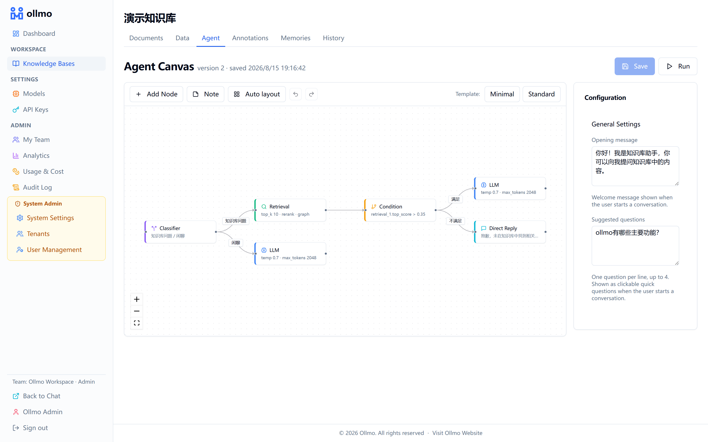
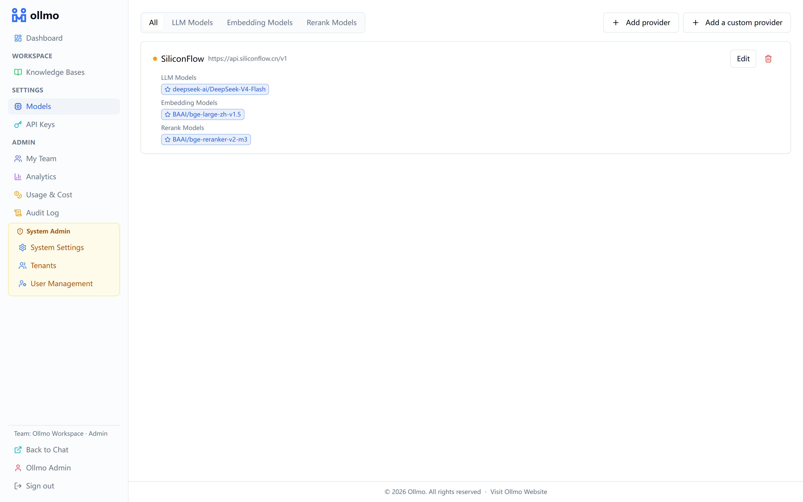
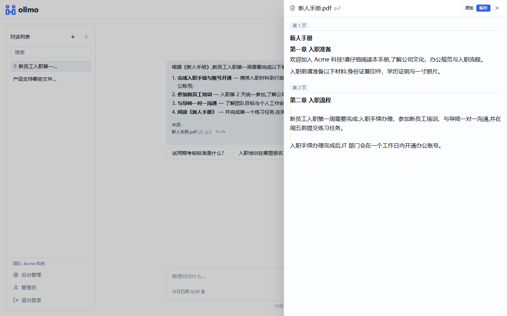
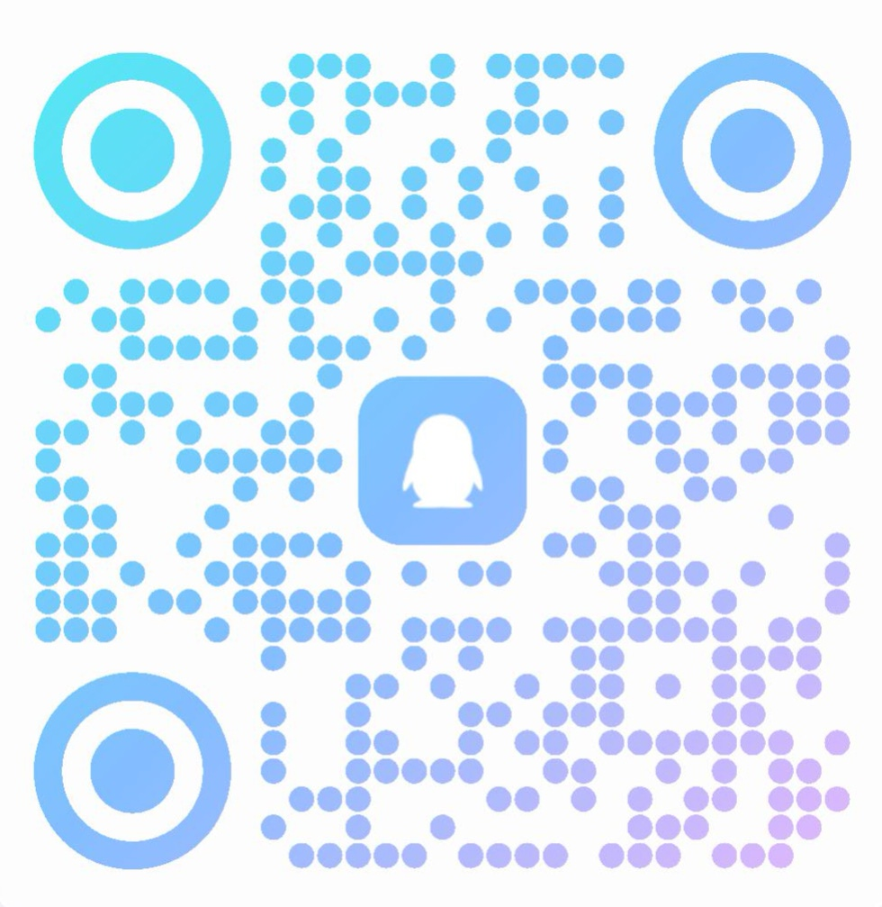

<div align="center">

# ollmo

**Open LLM Orchestrator**

Your data never leaves — build your own AI productivity tools from your knowledge base.

A production-grade RAG platform with hybrid retrieval, multi-tenancy, and streaming chat.
Built with Go + Fiber (backend) and Next.js App Router + shadcn/ui (frontend).

[Live Demo](https://demo.ollmo.com/) · [Quick Start](#quick-start) · [Documentation](#documentation) · [Roadmap](#roadmap) · [Contributing](#contributing)

</div>

<div align="center">

English | [简体中文](README.zh-CN.md)

</div>

> 🚀 **Live demo**: [demo.ollmo.com](https://demo.ollmo.com/) — account `demo@ollmo.com`, password `ollmo123`. Try it without deploying.

---



*Agent canvas — visually orchestrate the conversation pipeline (intent classification → retrieval → condition branch → LLM), with per-node debugging and runtime highlighting*



*Model settings — provider cards with the two-column model picker; LLM / Embedding / Rerank models can be pinned per knowledge base*



*Knowledge Q&A — streaming replies with source citations; clicking a citation opens the source document with the passage highlighted, side by side with the conversation*

## Why ollmo

Most AI application platforms bury you in workflows, nodes, plugins — dozens of concepts and hundreds of settings before the AI can actually help. AI should make things simpler, not the other way around.

ollmo converges everything into three steps: **upload documents, ask questions, get answers with sources**. One-command deployment, up and running in ten minutes.

- **Simple** — Does one thing and does it well: turn your documents into an assistant you can talk to.
- **Easy** — Up in ten minutes, no need to learn a system more complex than your business.
- **Restrained** — No concept stacking, no redundant configuration. Complexity stays inside; simplicity stays with you.

## Features

- **Hybrid Retrieval** — Semantic and keyword retrieval fused together, with KB-level rerank configuration; built-in retrieval testing with an adjustable keyword ↔ semantic weight slider.
- **Multi-Tenancy** — Logical isolation across MySQL, Milvus, and MinIO.
- **Document Pipeline** — Upload (drag & drop, paste, multi-file, or URL import) → parse (MinerU / local parser) → chunk (paragraph, token, header-aware, Q&A, parent-child) → embed → index, fully async.
- **Streaming Chat** — Real-time streaming with source citations, follow-up suggestions, and multi-device stream sync. A client disconnect never loses the reply: the reply keeps being generated server-side, saving the completed answer (and billing) even if the tab is closed. DeepSeek-style greeting: a centered empty state with the agent's opening message and a date-grouped conversation list.
- **Citation Tracing** — Clicking a citation opens the source document with the cited passage highlighted in place: PDF rendering, paginated parsed view, and a side-by-side chat + document panel.
- **Answer Feedback** — Up/down vote on any answer; downvotes flow into the analytics "bad-case review" list and deep-link straight into the execution replay for debugging.
- **Annotation Q&A** — Curated question/answer pairs per KB; a close match answers verbatim, keeping high-frequency answers consistent.
- **Auto-Memory** — Long conversations are automatically summarized in the background; summaries are injected into later sessions for cross-conversation continuity. Toggleable site-wide, with a per-KB memory page to review and delete summaries.
- **Personal Center** — Click your avatar in the bottom-left account card menu to open the personal center: profile info, password change, and "My Usage" (personal message quota, token consumption, estimated cost, and recent call records) — members can track their own usage without entering the console.
- **Agent Canvas** — Visual agent pipeline: intent classification → retrieval → condition branch → LLM → direct reply. Node outputs are referenceable variables (`{node.output}`) in prompts and conditions, enabling LLM chaining and generic branching; per-node debug shows output variables, and nodes highlight live during execution. In-canvas undo/redo and sticky notes. Per-KB system prompt, temperature, retrieval parameters, rerank toggle, opening message, and LLM selection.
- **Execution Replay** — Every agent run (real chats and test-drawer runs) is recorded with a node-by-node trace and replayable on a read-only canvas; conversation messages and analytics feedback deep-link into the replay for debugging and tuning.
- **Ingestion Pipeline Canvas** — Visual ingestion pipeline: source → parser → chunker → embedder → sink, with configurable parsing options, chunking strategy, and batch size.
- **KB Backup & Restore** — Export a knowledge base (metadata, documents, chunks) to a JSON file and import it back into any KB; embeddings are rebuilt automatically by re-indexing after import.
- **GraphRAG** — LLM-powered entity & relation extraction at ingestion; entity matching enriches retrieval context at query time.
- **Configurable Models** — Tenant-level LLM / Embedding / Rerank provider management via web UI, with per-KB overrides. Two-column popup selector (provider list on left, models on right) for intuitive model switching. Each model row has collapsible capacity settings for max output tokens and billing unit prices (¥ per 1M tokens); unsaved draft models can be tested before saving. Selection priority: KB config → tenant default.
- **Usage & Cost** — Team-level token/cost accounting: overview, per-user and per-model totals, and raw call records. Every LLM invocation (main reply, agent classifier/intermediate nodes, follow-up suggestions) is charged automatically; visible to admins only.
- **Team & Access Control** — Invitation-based membership with admin / member roles and per-user daily message quotas. Clean role separation: admins manage knowledge bases, models, and team data in the console, while members focus on chatting; KBs are either private or team-shared.
- **Admin Console** — Super-admin user management, tenant management with plan & quota control (free / pro / enterprise), system settings (registration toggle, auto-memory, custom site logo), analytics dashboard, and audit logging.
- **External API** — API-key authenticated programmatic access (search, KB management, streaming chat); keys are created and managed by admins.
- **Internationalization** — Chinese / English UI. No locale in URL paths.

## Tech Stack

| Layer | Choice |
|---|---|
| Backend | Go 1.26+ / Fiber / GORM |
| Frontend | Next.js 15 (App Router) / React / shadcn-ui |
| Database | MySQL 8.0 (utf8mb4) — metadata |
| Vector DB | Milvus 2.5+ — dense vector retrieval |
| Object Storage | MinIO (S3 compatible) — original docs, parsed output, thumbnails |
| Task Queue | Asynq + Redis — parsing, embedding, index rebuild, auto-summarization |
| Document Parser | MinerU (containerized, GPU optional) + local fallback parser |
| Auth | Local account (email + password + JWT) |

## Architecture

```
                    ┌─────────────────────────────────────────────────────┐
                    │                   Next.js Web (3001)                 │
                    └────────────────────────┬────────────────────────────┘
                                             │ HTTP / SSE
                    ┌────────────────────────▼────────────────────────────┐
                    │                Go API Server (8080)                 │
                    │  Fiber · JWT auth · Tenant isolation · RESTful API  │
                    └───────┬────────────┬──────────────┬─────────────────┘
                            │            │              │
                   ┌────────▼──┐  ┌──────▼──────┐  ┌───▼────────────┐
                   │  MySQL    │  │   Redis     │  │    MinIO       │
                   │ metadata  │  │ task queue  │  │  file storage  │
                   └───────────┘  └──────┬──────┘  └────────────────┘
                                         │
                                ┌────────▼────────┐
                                │  Asynq Worker   │
                                │ parse · embed · │
                                │   summarize     │
                                └────────┬────────┘
                                         │
                                ┌────────▼────────┐
                                │     Milvus      │
                                │ dense (vectors) │
                                └─────────────────┘
```

## Project Layout

```
ollmo/
├── server/                 # Go backend (API + worker share the same binary)
│   ├── main.go             # Entry point: `go run . api|worker|migrate`
│   ├── internal/           # Business domains (one package per domain)
│   │   ├── agent/          # Agent canvas config & execution
│   │   ├── analytics/      # Usage statistics & activity feed
│   │   ├── annotation/     # Annotation Q&A pairs (curated standard answers)
│   │   ├── apikey/         # API key management & middleware
│   │   ├── audit/          # Audit logging
│   │   ├── auth/           # Authentication (email + password + JWT)
│   │   ├── backup/         # KB export/import (JSON backup & restore)
│   │   ├── bill/           # Usage & cost accounting (token/cost records)
│   │   ├── chat/           # Streaming chat with citations
│   │   ├── doc/            # Document lifecycle, chunking, worker
│   │   ├── embedding/      # Embedding model management
│   │   ├── execution/      # Agent run traces & replay
│   │   ├── graph/          # GraphRAG (entity extraction & retrieval)
│   │   ├── install/        # First-run install wizard
│   │   ├── invitation/     # Team invitation system
│   │   ├── kb/             # Knowledge base CRUD
│   │   ├── llm/            # LLM model management
│   │   ├── memory/         # Auto-summarization & cross-session context
│   │   ├── pipeline/       # Ingestion pipeline canvas config
│   │   ├── provider/       # Unified model provider cards (LLM/embedding/rerank)
│   │   ├── rerank/         # Rerank model management
│   │   ├── search/         # Hybrid retrieval (dense + lexical + rerank)
│   │   ├── site/           # Site-wide settings
│   │   ├── team/           # KB membership & access control
│   │   ├── tenant/         # Tenant, plan & quota management
│   │   ├── user/           # User management
│   │   └── ...
│   ├── pkg/                # Shared infrastructure (db, vector, clients)
│   └── config.yaml
├── web/                    # Next.js frontend
│   ├── app/                # App Router pages ('/' chat, '/dashboard/*' admin console, admins/super admins only)
│   ├── components/         # UI + feature components (agent, pipeline, etc.)
│   ├── lib/                # API client, i18n, utils
│   └── messages/           # i18n message files (zh, en)
├── deploy/                 # Dockerfiles
├── docker-compose.yml      # Full-stack local deployment
└── Makefile                # Dev & build targets
```

## Quick Start

### Prerequisites

- [Docker](https://docs.docker.com/get-docker/) + Docker Compose
- [Go](https://go.dev/dl/) 1.26+
- [Node.js](https://nodejs.org/) 20+
- [Make](https://www.gnu.org/software/make/) (optional, for convenience targets)

### 1. Clone & configure

```bash
git clone https://github.com/ollmo-go/ollmo.git
cd ollmo
cp .env.example .env
```

### 2. Start infrastructure

```bash
make up
```

This starts MySQL, Redis, MinIO, Milvus, and the Asynqmon dashboard.

| Service | URL | Credentials |
|---------|-----|-------------|
| MySQL | `localhost:3306` | `ollmo` / `ollmo_dev_pwd` |
| MinIO Console | http://localhost:9001 | `minioadmin` / `minioadmin` |
| Milvus | `localhost:19530` | — |
| Asynqmon UI | http://localhost:8081 | — |

### 3. Run database migrations

```bash
make migrate
```

### 4. Start backend (API + worker)

```bash
# Terminal 1: API server
make server

# Terminal 2: Asynq worker (parsing, embedding, auto-summarization)
make worker
```

### 5. Start frontend

```bash
make web          # http://localhost:3001
```

### 6. One-click install

Open http://localhost:3001 — the install wizard appears on first visit. Fill in the admin email, password, and optionally a SiliconFlow API key. On confirm, the system automatically:

1. Creates the admin tenant and super-admin user
2. Seeds a SiliconFlow provider with LLM (DeepSeek-V4-Flash), embedding (BGE-Large-ZH), and rerank (BGE-Reranker-V2-M3) models
3. Creates a **demo knowledge base** with a standard-template agent canvas (intent classifier → retrieval → condition → LLM / direct reply + free-chat branch)
4. Uploads a demo document that is automatically parsed, chunked, and embedded

After install, you can immediately ask questions on the home page — no manual configuration needed.

> Registration is **disabled** by default after install. Enable it via System Settings when you are ready to invite users.

### Full stack via Docker

```bash
make up-full      # Builds & starts everything (infra + server + worker + web)
```

## Configuration

| Source | Purpose |
|--------|---------|
| `server/config.yaml` | Backend defaults (DB, Redis, MinIO, Milvus, MinerU, JWT, quotas) |
| `.env` | Environment overrides for Docker deployment |
| Web UI → Settings | Per-tenant LLM / Embedding / Rerank models (with default selection) |
| Web UI → KB Settings | Per-KB embedding / rerank model override |
| Web UI → Agent Canvas | Per-KB agent config (system prompt, LLM, retrieval params, opening message) |
| Web UI → Pipeline Canvas | Per-KB ingestion config (parser, chunker, batch size) |
| Web UI → System Settings | Site-wide settings (registration toggle, auto-memory) — super admin only |

Model selection priority: KB-level config → tenant default → config.yaml fallback.

## Development

- All development happens on the `dev` branch. `main` is release-only.
- Modules are organized by **business domain**, not technical layer. Each domain package contains its own `model.go` / `repo.go` / `service.go` / `handler.go`.
- Comments are kept in English and minimal — only where the intent is non-obvious.

```bash
make build         # Build server binary + web
make build-docker  # Build Docker images
make clean         # Remove build artifacts
```

## Documentation

- [Live Demo](https://demo.ollmo.com/) — Try it before you deploy.

## Community

- 💬 **QQ group**: `656868` (mention ollmo when joining)



- 🐛 Bug reports: [GitHub Issues](https://github.com/ollmo-go/ollmo/issues)

## Roadmap

- [x] **Phase 1 — MVP**: KB/document CRUD, document parsing, embedding, hybrid retrieval, streaming chat with citation, local auth + tenant isolation.
- [x] **Phase 2 — Configurability**: Multi LLM/Embedding/Rerank providers, KB editing with re-indexing, rerank, multi chunking strategies, drag & drop upload, i18n.
- [x] **Phase 3 — Intelligence**: Ingestion Pipeline canvas (React Flow), GraphRAG, Agent canvas, Memory, role-based access control, external API, team management.
- [x] **Phase 4 — Production Readiness**: Analytics dashboard, usage & cost (billing), audit logging, conversation management (search / rename / export / pin), auto-memory summarization, personal center, annotation Q&A, super-admin console (users, tenants, plans & quotas, system settings), registration toggle, KB backup & restore, execution replay, answer feedback.
- [ ] **Phase 5 — Document Intelligence**:

  ### 5.1 Document Preview & Citation Tracing ✅
  - [x] In-chat citation clicks jump to the source document with the cited passage highlighted
  - [x] Document viewer: PDF render, markdown/text preview, page navigation
  - [x] Chunk-to-source mapping (chunk → document → page/offset)
  - [x] Side-by-side view: chat + source document

  ### 5.2 Advanced Document Parsing
  - Table extraction: preserve table structure as HTML for structured retrieval
  - Image extraction: store images in MinIO, embed captions, support vision LLM Q&A
  - Layout-aware parsing: recognize headers, footers, columns, footnotes
  - OCR improvement: scanned document support with language detection

  ### 5.3 External API Expansion
  - Full CRUD via API key: upload documents, create/manage KBs, list conversations
  - OpenAPI/Swagger documentation at `/api/v1/docs`
  - Rate limiting per API key (requests/min, tokens/day)
  - Webhook callbacks for document processing events (parsed, embedded, failed)

## Contributing

1. Fork the repository and create your branch from `dev`.
2. Ensure `make build` passes before submitting a PR.
3. Keep changes focused — one feature or fix per PR.
4. Follow existing code style: English comments, domain-driven package structure.

## License

Apache License 2.0 with additional conditions. See [LICENSE](LICENSE) for details.

In short:
- ✅ Free for personal use, internal enterprise use, and commercial application development.
- ❌ Operating a multi-tenant SaaS service similar to ollmo requires a commercial license.
- ❌ Removing or modifying the ollmo brand, LOGO, or copyright notices in the console is prohibited.
