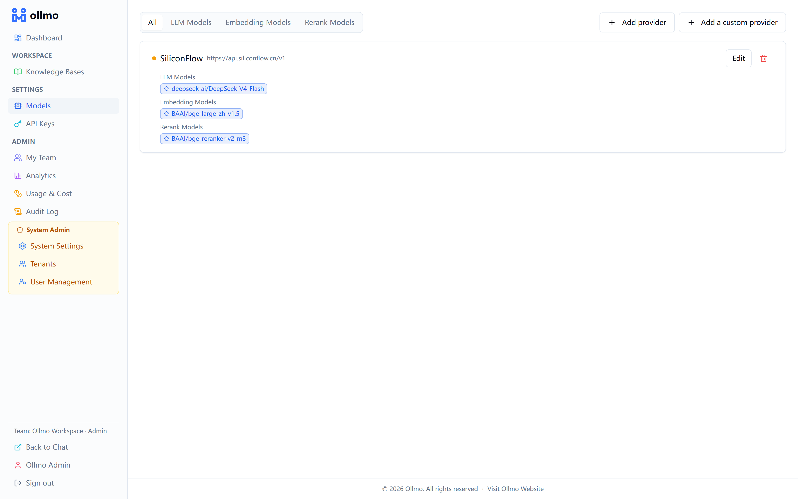

<div align="center">

# ollmo

**Open LLM Orchestrator · 开源大模型编排器**

数据不出门，用自己的知识库，打造专属 AI 生产力工具。

生产级 RAG 平台，提供混合检索、多租户隔离与流式对话能力。
后端基于 Go + Fiber，前端基于 Next.js App Router + shadcn/ui。

[系统演示](https://demo.ollmo.com/) · [快速开始](#快速开始) · [文档](#文档) · [路线图](#路线图) · [参与贡献](#参与贡献)

</div>

<div align="center">

[English](README.md) | 简体中文

</div>

---





## 为什么做 ollmo

市面上的 AI 应用编排平台：工作流、节点、插件，几十个概念、上百项配置。想让 AI 帮个忙，得先花好几天学会一套复杂的系统。AI 本该让事情变简单，结果却背道而驰。

ollmo 把一切收敛成三步：**上传文档、提出问题、拿到带出处的答案**。一条命令部署，十分钟上手。

- **简单** — 只做一件事并做到极致：把你的文档变成能问答的助手。
- **易用** — 十分钟上手，不需要先学会一套比业务还复杂的系统。
- **克制** — 不堆概念、不加多余配置，复杂留在系统内部，简单留给你。

## 核心特性

- **混合检索** — Milvus 稠密向量 + MySQL FULLTEXT 词法匹配，RRF 融合，支持知识库级 Rerank 配置；内置检索测试，关键词 ↔ 语义权重可调。
- **多租户** — MySQL、Milvus、MinIO 全链路逻辑隔离，所有表携带 `tenant_id`。
- **文档流水线** — 上传（拖拽、粘贴、多文件）→ 解析（MinerU / 本地解析器）→ 分块 → 向量化 → 索引，全程异步（Asynq + Redis）。
- **流式对话** — SSE 实时流式输出，带来源引用；Agent 开场白带来拟人化问候。
- **标注问答** — 为知识库维护人工标注的标准问答（向量相似度匹配），命中即直接返回标准答案，保证高频问题的回答稳定一致。
- **自动记忆** — 长对话在后台自动生成摘要（异步 LLM 任务），摘要注入后续会话，实现跨对话上下文延续，支持站点级开关。
- **个人中心** — 聊天页点击用户名打开个人中心：基本信息、修改密码与「我的用量」（个人消息额度、Token 消耗、费用估算与最近调用记录），成员无需进入后台即可掌握自己的使用情况。
- **Agent 画布** — 可视化编排 Agent 流水线（React Flow）：意图分类 → 检索 → 条件分支 → LLM → 直接回复。节点输出以变量（`{node.output}`）在提示词与条件中引用，支持 LLM 链式调用与通用条件分支；单节点调试直接查看输出变量，运行时节点实时高亮。画布内置撤销/重做与便签。支持知识库级系统提示词、温度、top_k、Rerank 开关、开场白与 LLM 选择。
- **数据处理流水线画布** — 可视化入库 DAG（React Flow）：来源 → 解析器 → 分块器 → 向量化 → 存储，可配置解析选项、分块策略与批大小。
- **GraphRAG** — 入库时 LLM 抽取实体与关系，查询时实体匹配增强检索上下文。
- **模型可配置** — 租户级管理 LLM / Embedding / Rerank 模型，知识库可单独指定。双栏弹窗选择器（左侧供应商列表、右侧模型列表），切换直观高效。选择优先级：知识库配置 → 租户默认 → config.yaml。
- **用量与费用** — 团队级 Token / 费用统计：总览、按用户、按模型与调用明细，自动记录每次 LLM 调用的消耗（主回复、Agent 分类与中间节点、追问建议），仅管理员可见。
- **团队与权限** — 邀请制成员管理（管理员 / 成员），每用户每日消息配额。清晰的角色分工：管理员在后台管理知识库、模型与团队数据，成员专注于对话使用；知识库支持私有 / 团队共享两种可见性。
- **管理控制台** — 超级管理员用户管理、团队管理（计划与配额：免费版 / 专业版 / 企业版）、系统设置（注册开关、自动记忆）、数据分析看板、审计日志。
- **外部 API** — API Key 鉴权的编程式访问（检索、知识库管理、流式对话）；密钥由管理员统一创建与管理。
- **国际化** — 中英文界面，前后端消息契约，URL 不含语言标识。

## 技术栈

| 层 | 选型 |
|---|---|
| 后端 | Go 1.26+ / Fiber / GORM |
| 前端 | Next.js 15 (App Router) / React / shadcn-ui |
| 数据库 | MySQL 8.0 (utf8mb4) — 元数据 |
| 向量库 | Milvus 2.5+ — 稠密向量检索 |
| 对象存储 | MinIO（S3 兼容）— 原始文档、解析产物、缩略图 |
| 任务队列 | Asynq + Redis — 解析、向量化、索引重建、自动摘要 |
| 文档解析 | MinerU（容器化，可选 GPU）+ 本地解析器 |
| 认证 | 本地账号（邮箱 + 密码 + JWT） |

## 架构

```
                    ┌─────────────────────────────────────────────────────┐
                    │                   Next.js Web (3001)                 │
                    └────────────────────────┬────────────────────────────┘
                                             │ HTTP / SSE
                    ┌────────────────────────▼────────────────────────────┐
                    │                Go API Server (8080)                 │
                    │  Fiber · JWT 认证 · 租户隔离 · RESTful API           │
                    └───────┬────────────┬──────────────┬─────────────────┘
                            │            │              │
                   ┌────────▼──┐  ┌──────▼──────┐  ┌───▼────────────┐
                   │  MySQL    │  │   Redis     │  │    MinIO       │
                   │  元数据    │  │  任务队列    │  │   文件存储      │
                   └───────────┘  └──────┬──────┘  └────────────────┘
                                         │
                                ┌────────▼────────┐
                                │  Asynq Worker   │
                                │ 解析 · 向量化 ·  │
                                │    自动摘要      │
                                └────────┬────────┘
                                         │
                                ┌────────▼────────┐
                                │     Milvus      │
                                │    稠密向量检索    │
                                └─────────────────┘
```

## 项目结构

```
ollmo/
├── server/                 # Go 后端（API 与 worker 共用同一二进制）
│   ├── main.go             # 入口：`go run . api|worker|migrate`
│   ├── internal/           # 业务领域（一个包一个领域）
│   │   ├── agent/          # Agent 画布配置与执行
│   │   ├── analytics/      # 用量统计与动态
│   │   ├── apikey/         # API Key 管理与中间件
│   │   ├── audit/          # 审计日志
│   │   ├── auth/           # 认证（邮箱 + 密码 + JWT）
│   │   ├── bill/           # 用量与费用（Token / 成本记账）
│   │   ├── chat/           # 流式对话与引用
│   │   ├── doc/            # 文档生命周期、分块、worker
│   │   ├── embedding/      # 嵌入模型管理
│   │   ├── graph/          # GraphRAG（实体抽取与检索）
│   │   ├── invitation/     # 团队邀请
│   │   ├── kb/             # 知识库 CRUD
│   │   ├── llm/            # LLM 模型管理
│   │   ├── memory/         # 自动摘要与跨会话上下文
│   │   ├── pipeline/       # 数据处理流水线画布配置
│   │   ├── rerank/         # 重排模型管理
│   │   ├── search/         # 混合检索（稠密 + 词法 + 重排）
│   │   ├── site/           # 站点级设置
│   │   ├── team/           # 知识库成员与访问控制
│   │   ├── tenant/         # 租户、计划与配额管理
│   │   ├── user/           # 用户管理
│   │   └── ...
│   ├── pkg/                # 共享基础设施（db、vector、clients）
│   └── config.yaml
├── web/                    # Next.js 前端
│   ├── app/                # App Router 页面（'/' 对话，'/dashboard/*' 管理后台，仅管理员 / 超管）
│   ├── components/         # UI 与功能组件（agent、pipeline 等）
│   ├── lib/                # API 客户端、i18n、工具
│   └── messages/           # i18n 消息文件（zh、en）
├── deploy/                 # Dockerfile
├── docker-compose.yml      # 全栈本地部署
└── Makefile                # 开发与构建目标
```

## 快速开始

### 前置条件

- [Docker](https://docs.docker.com/get-docker/) + Docker Compose
- [Go](https://go.dev/dl/) 1.26+
- [Node.js](https://nodejs.org/) 20+
- [Make](https://www.gnu.org/software/make/)（可选，提供便捷命令）

### 1. 克隆并配置

```bash
git clone https://github.com/ollmo-go/ollmo.git
cd ollmo
cp .env.example .env
```

### 2. 启动基础设施

```bash
make up
```

启动 MySQL、Redis、MinIO、Milvus 与 Asynqmon 面板。

| 服务 | 地址 | 凭据 |
|---------|-----|-------------|
| MySQL | `localhost:3306` | `ollmo` / `ollmo_dev_pwd` |
| MinIO 控制台 | http://localhost:9001 | `minioadmin` / `minioadmin` |
| Milvus | `localhost:19530` | — |
| Asynqmon 面板 | http://localhost:8081 | — |

### 3. 执行数据库迁移

```bash
make migrate
```

### 4. 启动后端（API + worker）

```bash
# 终端 1：API 服务
make server

# 终端 2：Asynq worker（解析、向量化、自动摘要）
make worker
```

### 5. 启动前端

```bash
make web          # http://localhost:3001
```

### 6. 一键安装

打开 http://localhost:3001 — 首次访问会自动进入安装向导。填写管理员邮箱、密码，并可选择填入 SiliconFlow API Key。确认后，系统会自动：

1. 创建管理员团队与超级管理员用户
2. 预置 SiliconFlow 供应商，包含 LLM（DeepSeek-V4-Flash）、Embedding（BGE-Large-ZH）、Rerank（BGE-Reranker-V2-M3）模型
3. 创建**演示知识库**，内置标准模板 Agent 画布（意图分类 → 检索 → 条件分支 → LLM / 直接回复 + 闲聊分支）
4. 上传演示文档并自动完成解析、切片与向量化

安装完成后，直接在首页输入问题即可体验完整问答流程，无需手动配置。

> 安装后默认**关闭注册**。需要邀请用户时，可在系统设置中开启。

### Docker 全栈部署

```bash
make up-full      # 构建并启动全部服务（基础设施 + server + worker + web）
```

## 配置

| 来源 | 用途 |
|--------|---------|
| `server/config.yaml` | 后端默认配置（DB、Redis、MinIO、Milvus、MinerU、JWT、配额） |
| `.env` | Docker 部署的环境变量覆盖 |
| Web UI → 设置 | 租户级 LLM / Embedding / Rerank 模型（含默认选择） |
| Web UI → 知识库设置 | 知识库级嵌入 / 重排模型覆盖 |
| Web UI → Agent 画布 | 知识库级 Agent 配置（系统提示词、LLM、检索参数、开场白） |
| Web UI → 流水线画布 | 知识库级入库配置（解析器、分块器、批大小） |
| Web UI → 系统设置 | 站点级设置（注册开关、自动记忆）— 仅超级管理员 |

模型选择优先级：知识库配置 → 租户默认 → config.yaml 兜底。

## 开发约定

- 所有开发在 `dev` 分支进行，`main` 仅用于发布。
- 模块按**业务领域**划分，而非技术分层。每个领域包包含自己的 `model.go` / `repo.go` / `service.go` / `handler.go`。
- 注释使用英文且保持精简 — 只在意图不明显处添加。

```bash
make build         # 构建 server 二进制 + web
make build-docker  # 构建 Docker 镜像
make clean         # 清理构建产物
```

## 文档

- [系统演示](https://demo.ollmo.com/) — 部署前先体验。

## 路线图

- [x] **阶段 1 — MVP**：知识库/文档 CRUD、文档解析、向量化、混合检索、带引用的流式对话、本地认证 + 租户隔离。
- [x] **阶段 2 — 可配置化**：多 LLM/Embedding/Rerank 供应商、知识库编辑与重建索引、重排、多分块策略、拖拽上传、国际化。
- [x] **阶段 3 — 智能化**：数据处理流水线画布（React Flow）、GraphRAG、Agent 画布、记忆、基于角色的访问控制、外部 API、团队管理。
- [x] **阶段 4 — 生产就绪**：数据分析看板、用量与费用（账单）、审计日志、对话管理（搜索 / 重命名 / 导出 / 置顶）、自动记忆摘要、个人中心、标注问答、超级管理员控制台（用户、团队、计划与配额、系统设置）、注册开关。
- [ ] **阶段 5 — 文档智能**：

  ### 5.1 文档预览与引用溯源
  - 对话中点击引用跳转至源文档，并高亮引用段落
  - 文档查看器：PDF 渲染、Markdown/文本预览、翻页导航
  - 分块到来源的映射（分块 → 文档 → 页码/偏移）
  - 并排视图：对话 + 源文档

  ### 5.2 高级文档解析
  - 表格抽取：保留表格结构为 HTML，支持结构化检索
  - 图片抽取：图片存入 MinIO，嵌入图注，支持视觉 LLM 问答
  - 版面感知解析：识别页眉、页脚、分栏、脚注
  - OCR 增强：扫描件支持与语言检测

  ### 5.3 外部 API 扩展
  - API Key 全量 CRUD：上传文档、创建/管理知识库、列出对话
  - `/api/v1/docs` 提供 OpenAPI/Swagger 文档
  - 按 API Key 限流（请求/分钟、token/天）
  - 文档处理事件 Webhook 回调（已解析、已向量化、失败）

## 参与贡献

1. Fork 仓库，并从 `dev` 分支创建你的分支。
2. 提交 PR 前确保 `make build` 通过。
3. 保持改动聚焦 — 每个 PR 只做一个功能或修复。
4. 遵循现有代码风格：英文注释、领域驱动的包结构。

## 许可证

Apache License 2.0 附加条件。详见 [LICENSE](LICENSE)。

简而言之：
- ✅ 个人使用、企业内部使用、商业应用开发免费。
- ❌ 运营与 ollmo 类似的多租户 SaaS 服务需获得商业授权。
- ❌ 禁止移除或修改控制台中的 ollmo 品牌、LOGO 与版权信息。
